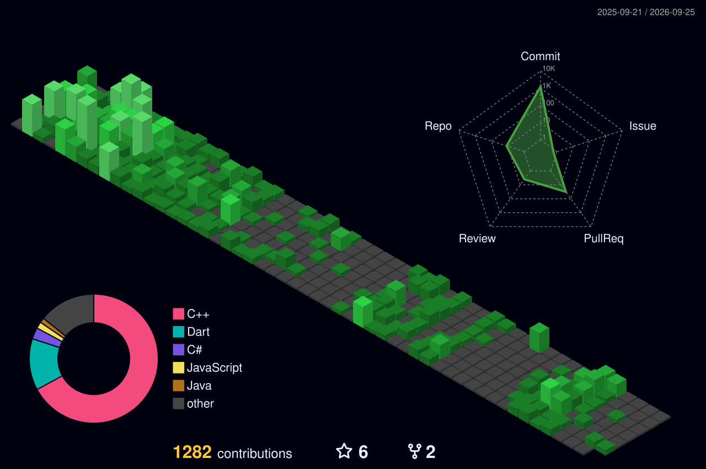

<!------------------------Header section ----------------------------->

<!--

 

-->

<!------------------------About Me section ----------------------------->
#

**Problem Solver | Aspiring Junior .NET Developer**  

Building my expertise in the **.NET ecosystem**, with a strong interest in **DSA, software development, emerging technologies, and open-source contribution**.

**Learning. Building. Solving. Contributing.**

 ##

<!------------------------Coding Profile section ----------------------------->

<table align="center">
<tr>

<td align="center" valign="top" width="50%">

 

<!--

-->
</td>

<td align="center" valign="top" width="50%">

 

</td>

</tr>
</table>

<!------------------------Github Stats and Trophies section ----------------------------->
<!--
##

 

  
  

 

  

-->

<!------------------------Lenguage & Tools section ----------------------------->

##

<!------------------------Footer section ----------------------------->
##

  

